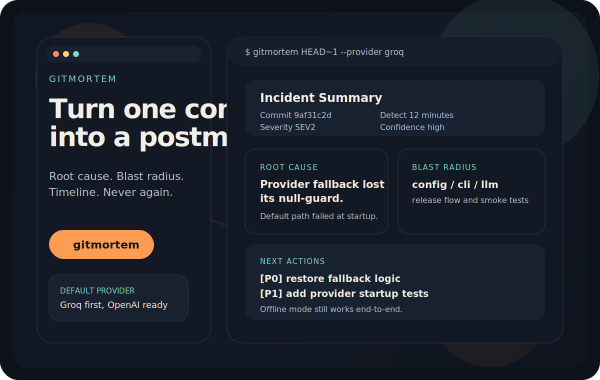
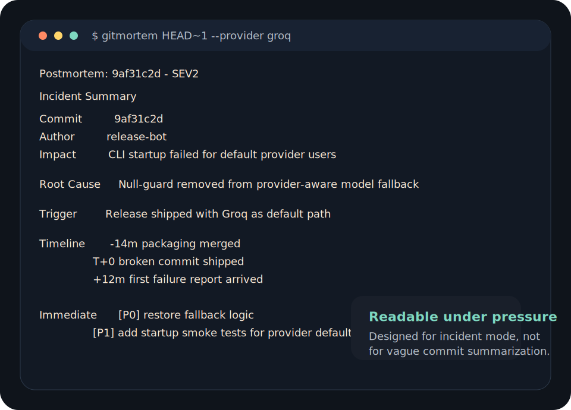
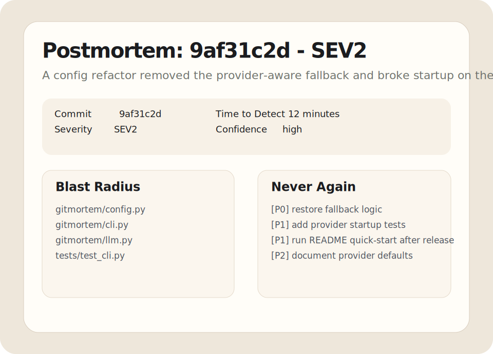

<p align="center">
  
</p>

# gitmortem

> Turn a suspicious commit into a postmortem people can act on.

[](https://github.com/lekhanpro/gitmortem/actions/workflows/ci.yml)
[](LICENSE)
[](https://lekhanpro.github.io/gitmortem/)
[](https://github.com/lekhanpro/gitmortem#provider-support)

`gitmortem` turns a commit hash into an incident report: root cause, blast radius, timeline, severity, and the never-again checklist.

It is built for the moment after "which commit broke this?" when the real question becomes "what exactly happened, who does it affect, and what do we fix first?"

## Live Surface

- GitHub Pages: https://lekhanpro.github.io/gitmortem/
- Repository: https://github.com/lekhanpro/gitmortem
- Sample report: [examples/sample-postmortem.md](examples/sample-postmortem.md)

## Demo

<p align="center">
  
</p>

<p align="center">
  
</p>

## Why This Repo Can Travel Better

- The output is shaped like a real postmortem, not a vague diff summary.
- Groq is the default fast path, but the provider layer is not locked in.
- The repo includes docs, install scripts, example output, release automation, and Pages-ready marketing surface.
- There is an offline mode for teams that want deterministic git facts without an LLM.

## Install

### Python via pip

Works today directly from GitHub:

```bash
python -m pip install git+https://github.com/lekhanpro/gitmortem.git
```

After the first tagged PyPI release, this becomes:

```bash
pip install gitmortem
```

### curl | bash

```bash
curl -fsSL https://raw.githubusercontent.com/lekhanpro/gitmortem/main/install.sh | bash
```

### npm wrapper

```bash
npm install -g github:lekhanpro/gitmortem
```

The npm package is a wrapper that bootstraps and runs the Python CLI. Python 3.10+ is still required.

### Windows PowerShell

```powershell
irm https://raw.githubusercontent.com/lekhanpro/gitmortem/main/install.ps1 | iex
```

## Quick Start

Groq is the default provider:

```bash
export GROQ_API_KEY=your_key
gitmortem HEAD~1
```

Different provider:

```bash
export OPENAI_API_KEY=your_key
gitmortem HEAD~1 --provider openai
```

Offline mode:

```bash
gitmortem HEAD~1 --no-llm -o reports/incident.md --html
```

## Output Includes

- incident summary
- root cause
- trigger and contributing factors
- blast radius
- timeline reconstruction
- immediate actions with priority
- prevention checklist
- detection improvements

## Provider Support

`gitmortem` defaults to Groq because it is fast and inexpensive for this workflow. It also supports OpenAI, Anthropic, OpenRouter, Ollama, and generic OpenAI-compatible endpoints.

| Provider | Env var | Notes |
|---|---|---|
| `groq` | `GROQ_API_KEY` | Default provider |
| `openai` | `OPENAI_API_KEY` | Native OpenAI API |
| `anthropic` | `ANTHROPIC_API_KEY` | Native Anthropic API |
| `openrouter` | `OPENROUTER_API_KEY` | OpenAI-compatible endpoint |
| `ollama` | none required | Local model path via `http://localhost:11434/v1` |
| `compatible` | provider-specific | Custom OpenAI-compatible base URL |

Examples:

```bash
gitmortem HEAD~1 --provider groq --model llama-3.3-70b-versatile
gitmortem HEAD~1 --provider anthropic --model claude-3-7-sonnet-latest
gitmortem HEAD~1 --provider compatible --base-url https://my-endpoint.example/v1 --api-key sk-...
```

## CLI

```bash
gitmortem COMMIT_HASH [OPTIONS]
```

Important options:

- `--repo`, `-r`: repository path
- `--output`, `-o`: write markdown report to a file
- `--html`: also emit a standalone HTML report
- `--html-output`: write HTML to a specific path
- `--provider`: `groq`, `openai`, `anthropic`, `openrouter`, `ollama`, `compatible`
- `--model`: override the default model for the chosen provider
- `--api-key`: inline API key override
- `--base-url`: custom base URL for compatible endpoints
- `--window`: surrounding commit window used for timeline reconstruction
- `--no-llm`: skip AI analysis and render a deterministic report

## Environment Variables

| Variable | Description |
|---|---|
| `GROQ_API_KEY` | Groq API key |
| `OPENAI_API_KEY` | OpenAI API key |
| `ANTHROPIC_API_KEY` | Anthropic API key |
| `OPENROUTER_API_KEY` | OpenRouter API key |
| `GITMORTEM_PROVIDER` | Default provider override |
| `GITMORTEM_MODEL` | Model override |
| `GITMORTEM_BASE_URL` | Base URL for `compatible` or custom routing |
| `GITMORTEM_OUTPUT_DIR` | Default directory for generated reports |

## Pages, Releases, and Publish Flow

- `docs/` contains the GitHub Pages landing site.
- `.github/workflows/ci.yml` runs lint and tests.
- `.github/workflows/publish.yml` is ready for tagged PyPI publishing.
- `.github/workflows/release.yml` builds and publishes GitHub release artifacts.
- `.github/workflows/pages.yml` deploys the docs site.

For `pip install gitmortem` to work from PyPI, configure PyPI trusted publishing or add the required PyPI token and create a version tag such as `v0.1.0`.

## Development

```bash
pip install -e ".[dev]"
pytest
ruff check .
python -m gitmortem HEAD~1 --no-llm
```

## License

MIT
